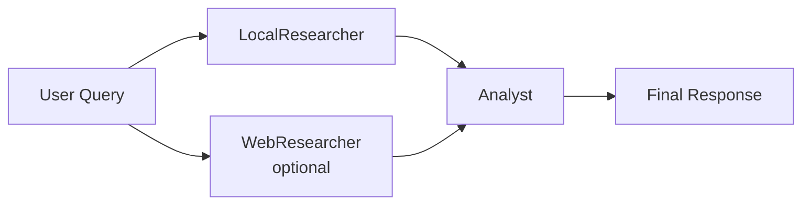

# Group 7 Chatbot
An AI web chatbot system built with a Node.js frontend server and a Python backend.  
The project supports local document retrieval, optional web search, multi-agent assistance and text-to-speech output.

## Project Overview

This project is a web-based chatbot designed to answer user questions by combining:

- Multi-Agent Cooperation [1]
- Local document retrieval with FAISS [2]
- LLM-based response generation
- Optional web search  [2]
- Optional text-to-speech (TTS)
- A simple browser-based frontend
- There is an implicit internal iteration feature that requires modifying the max_iter parameter in the chatbot.py file.  [3]
  
The system uses a **Node.js server** to serve the frontend and forward chat requests, while a **Flask backend** handles retrieval and response generation.


## Features

- Chat interface in browser
- Retrieval-augmented generation from local files
- FAISS vector index for efficient document search
- Optional web information retrieval
- Optional text-to-speech output using OpenAI audio API
- Deployable on Google Cloud Run

## Project Structure

## Project Structure

```text
.
├── frontend/                     # Frontend static files
│   ├── index.html               # Main chat page
│   ├── script.js                # Frontend chat logic
│   ├── settings.html            # Settings page
│   ├── settings.js              # Settings page logic
│   └── style.css                # Frontend styles
├── python_backend/              # Python backend
│   ├── data/                    # Local source documents
│   ├── faiss_index/             # FAISS index files
│   │   ├── index.faiss
│   │   └── index.pkl
│   ├── .env                     # Backend environment variables
│   ├── app.py                   # Flask API
│   ├── build_index.py           # Build FAISS index
│   └── chatbot.py               # Main chatbot logic
├── server/                      # Node.js server
│   ├── .env                     # Server environment variables
│   ├── package-lock.json
│   ├── package.json
│   └── server.js                # Node.js server entry
├── .gitignore
├── README.md
└── requirements.txt
```
## Development Environment

- Windows
- Node.js 24.14.0
- npm 11.9.0
- Python 3.11.9
- pip 26.0.1
- Git 2.51.1

## Prerequisites

Before running the project, make sure you have installed:

- Node.js
- npm
- Python 3.11+
- pip
- Git

## Installation

Clone the repository:

```bash
git clone <your-repository-url>
cd <your-repository-folder>
```

Install Python dependencies:

```bash
python -m venv venv
venv\Scripts\activate
pip install -r requirements.txt
```

Install Node.js dependencies:

```bash
cd server
npm install
cd ..
```

## Multi-Agent Design

The chatbot adopts a simple multi-agent architecture consisting of two parallel research components and one analysis component.

### 1. LocalResearcher
The LocalResearcher is responsible for retrieving relevant information from the local document collection. It uses a FAISS vector index to search embedded document chunks and returns the most relevant local evidence for the user query.

### 2. WebResearcher
The WebResearcher is responsible for optional external information retrieval. When web search is enabled, it searches online sources and returns a small set of relevant results as supplementary evidence.

### 3. Analyst
The Analyst is the final reasoning agent. It reads the outputs from both research components, keeps only the most important findings, prioritizes local evidence when it is directly relevant, and generates the final user-facing answer.

### Execution Flow

